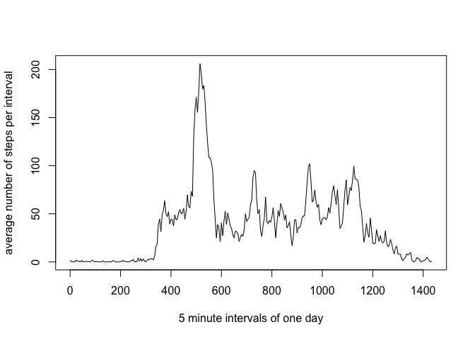
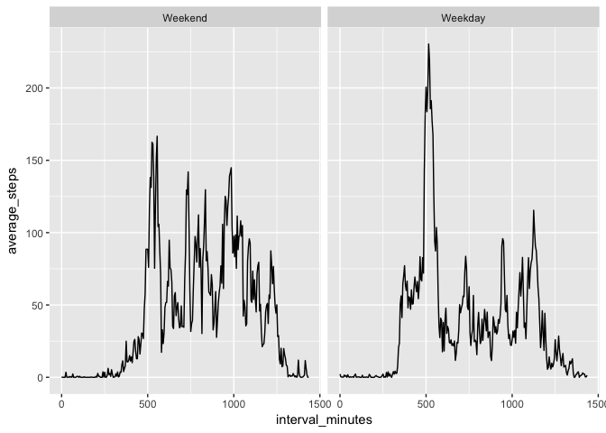

# Reproducible Research: Peer Assessment 1


## Introduction

The following report presents data recorded by a personal activity monitoring device on an anonymous individual. The device counts the steps (when the individual is moving) in 5 minute intervals through out the day. The data presented here are from the months October and November in 2012. 


## Loading and preprocessing the data

First set the working directory. The working directory is also the local git repository: 

```r
setwd("/Documents/Coursera_DataScience/ReproducibleResearch/RepData_PeerAssessment1")
```

Then load the data: 

```r
ActivityData <- read.csv("/Documents/Coursera_DataScience/ReproducibleResearch/RepData_PeerAssessment1/activity.csv")
```
Add interval labels that are more intuitive (to use for plots): 

```r
minute <- 0
for(i in 1:length(ActivityData$interval)){
	if(minute == 1440){
		minute <- 0
		ActivityData$interval_minutes[i] <- minute
		minute <- minute +5 
		}
	else {
		ActivityData$interval_minutes[i] <- minute
	minute <- minute +5
	}
}
```

For the first questions missing values can be ignored. So, we select the complete cases from the data set: 

```r
ActivityComplete <- ActivityData[complete.cases(ActivityData$steps),]
```


## What is mean total number of steps taken per day?

First the 'agregate' function is used to sum up the total number of steps for each day. Then the mean and the median value are calculated: 

```r
TotalStepsDay <- aggregate(x = ActivityComplete$steps, by = list(ActivityComplete$date), sum)

mean(TotalStepsDay$x)
```

```
## [1] 10766.19
```

```r
median(TotalStepsDay$x)
```

```
## [1] 10765
```

A histogram can give a rough impression on how many steps the individual typically takes per day: 

```r
hist(TotalStepsDay$x, ylab = "frequency", xlab = "number of steps per day")
```

<!-- -->


## What is the average daily activity pattern?

Taking the mean value for every five minute interval accross all days allows to identify a typical daily pattern of physical activity for the individual in question:

```r
AverageStepsInterval <- aggregate(x = ActivityComplete$steps, by = list(ActivityComplete$interval), mean)
```

A plot of the daily activity pattern can be obtained: 

```r
AverageStepsInterval$interval_minutes <- unique(ActivityData$interval_minutes)
plot(AverageStepsInterval$interval_minutes, AverageStepsInterval$x, type = "l", ylab = "average number of steps per interval", xlab = "5 minute intervals of one day")
```

<!-- -->

The five minute interval with the maximum number of steps is obtained by the following code: 

```r
index <- which(max(AverageStepsInterval$x) == AverageStepsInterval$x)
AverageStepsInterval$Group.1[index]
```

```
## [1] 835
```


## Imputing missing values

The number of missing values is obtained by the following code: 

```r
sum(is.na(ActivityData$steps))
```

```
## [1] 2304
```

Instead of ingnoring the missing values, they can be substituted by mean values. In the following every missing value is substituted by the mean value of the respective 5 minute interval: 

```r
DataWithNa <- ActivityData[is.na(ActivityData$steps), ]

ActivityDataImputed <- ActivityData

for(i in 1:length(unique(DataWithNa$interval))){
	ActivityDataImputed[is.na(ActivityDataImputed$steps) & ActivityDataImputed$interval == unique(DataWithNa$interval)[i], 1] <- AverageStepsInterval$x[i]
}
```

The total number of steps per day is recalculated taking into account the imputed values: 

```r
TotalStepsDayImputed <- aggregate(x = ActivityDataImputed$steps, by = list(ActivityDataImputed$date), sum)
```

A histogram gives an impression of the distribution of the number of steps per day with the imputed values taken into account: 

```r
hist(TotalStepsDayImputed$x, ylab = "frequency", xlab = "number of steps per day")
```

<!-- -->

Recalculating the mean and median values for the total number of steps per day after the missing values have been substituted with the corresponding mean values (imputing) shows that the overall mean value stays the same as without imputing missing values whereas the median value differs.

Average total number of steps per day with imputed values: 

```r
mean(TotalStepsDayImputed$x)
```

```
## [1] 10766.19
```
Average total number of steps per day neglecting missing values: 

```r
mean(TotalStepsDay$x)
```

```
## [1] 10766.19
```
Median value of the total number of steps per day with imputed values: 

```r
median(TotalStepsDayImputed$x)
```

```
## [1] 10766.19
```
Median value of the total number of steps per day neglecting missing values:

```r
median(TotalStepsDay$x)
```

```
## [1] 10765
```
The overall mean value is constituted by the mean values of the individual 5 minute intervals. Giving the same weight to each one of these means will conserve the overall mean. The missing values seem to consist of entire days without measurements, there don't seem to be any days partially lacking measurements. One day is subdivided into 288 intervals. The total number of missing values is: 


```r
dim(ActivityData[is.na(ActivityData$steps),])
```

```
## [1] 2304    4
```
2304 is a multiple of 288. So, it seems that the missing values are entirely made up of entire days without measurements. The following operations shows that indeed for each day where data are missing all 288 interval measurements are missing:

```r
MissingDataDates <- ActivityData[is.na(ActivityData$steps),2]
MissingIntervalsPerDay <- rep(0,length(unique(MissingDataDates)))
for(i in 1: length(unique(MissingDataDates))){
	MissingIntervalsPerDay[i] <- sum(MissingDataDates == unique(MissingDataDates)[i])
}
MissingIntervalsPerDay
```

```
## [1] 288 288 288 288 288 288 288 288
```
Since every day contains the same five minute intervals, this means that there is the same number of missing values for every 5 minute interval. Substituting them with the mean value of the respective interval therefore attributes the same weight to each mean value, hence the overall mean is conserved. 

The median refers to the rank of a value, i.e. it matters how many values are bigger or smaller than a specific value when determining whether or not this value is the median (for the median value the number of bigger values is equal to the number of smaller values). Hence, adding more values is likely to change the median value. Finally, since the mean is conserved, it is unsurprising that the histogram shows the same mode as when neglecting missing values. The frequency scale, however, is larger because more values are being taken into account. 


## Are there differences in activity patterns between weekdays and weekends?

The denomination of the weekdays are obtained by the following code: 

```r
ActivityDataImputed$WeekDay <- format(as.Date(ActivityDataImputed$date), "%a")

head(ActivityDataImputed)
```

```
##       steps       date interval interval_minutes WeekDay
## 1 1.7169811 2012-10-01        0                0     Mon
## 2 0.3396226 2012-10-01        5                5     Mon
## 3 0.1320755 2012-10-01       10               10     Mon
## 4 0.1509434 2012-10-01       15               15     Mon
## 5 0.0754717 2012-10-01       20               20     Mon
## 6 2.0943396 2012-10-01       25               25     Mon
```

A new column indicating whether or not a specific day is on a weekend is added to the data frame: 

```r
ActivityDataImputed$WE_Not <- "Sat" == ActivityDataImputed$WeekDay | "Sun" == ActivityDataImputed$WeekDay

head(ActivityDataImputed)
```

```
##       steps       date interval interval_minutes WeekDay WE_Not
## 1 1.7169811 2012-10-01        0                0     Mon  FALSE
## 2 0.3396226 2012-10-01        5                5     Mon  FALSE
## 3 0.1320755 2012-10-01       10               10     Mon  FALSE
## 4 0.1509434 2012-10-01       15               15     Mon  FALSE
## 5 0.0754717 2012-10-01       20               20     Mon  FALSE
## 6 2.0943396 2012-10-01       25               25     Mon  FALSE
```

The average number of steps per interval accross days is calculated again but this time separately for weekdays and weekends: 

```r
AverageStepsInterval_WE_not <- aggregate(x = ActivityDataImputed$steps, by = list(ActivityDataImputed$interval, ActivityDataImputed$WE_Not), mean)

colnames(AverageStepsInterval_WE_not) <- c("interval", "WE_not", "average_steps")

head(AverageStepsInterval_WE_not)
```

```
##   interval WE_not average_steps
## 1        0  FALSE    2.25115304
## 2        5  FALSE    0.44528302
## 3       10  FALSE    0.17316562
## 4       15  FALSE    0.19790356
## 5       20  FALSE    0.09895178
## 6       25  FALSE    1.59035639
```

A new column is added with the designations "weekday" or "weekend". This column contains the same information as the column 'ActivityDataImputed$WE_Not' but the designations are more intuitive, i.e. more readable: 

```r
AverageStepsInterval_WE_not$days[AverageStepsInterval_WE_not$WE_not] <- "Weekend"

AverageStepsInterval_WE_not$days[!AverageStepsInterval_WE_not$WE_not] <- "Weekday"

AverageStepsInterval_WE_not$days <- factor(AverageStepsInterval_WE_not$days, levels = c("Weekend", "Weekday"))

head(AverageStepsInterval_WE_not)
```

```
##   interval WE_not average_steps    days
## 1        0  FALSE    2.25115304 Weekday
## 2        5  FALSE    0.44528302 Weekday
## 3       10  FALSE    0.17316562 Weekday
## 4       15  FALSE    0.19790356 Weekday
## 5       20  FALSE    0.09895178 Weekday
## 6       25  FALSE    1.59035639 Weekday
```
Also add the intuitive interval labels again: 

```r
AverageStepsInterval_WE_not$interval_minutes <- c(unique(ActivityData$interval_minutes), unique(ActivityData$interval_minutes))
head(AverageStepsInterval_WE_not)
```

```
##   interval WE_not average_steps    days interval_minutes
## 1        0  FALSE    2.25115304 Weekday                0
## 2        5  FALSE    0.44528302 Weekday                5
## 3       10  FALSE    0.17316562 Weekday               10
## 4       15  FALSE    0.19790356 Weekday               15
## 5       20  FALSE    0.09895178 Weekday               20
## 6       25  FALSE    1.59035639 Weekday               25
```

```r
tail(AverageStepsInterval_WE_not)
```

```
##     interval WE_not average_steps    days interval_minutes
## 571     2330   TRUE    1.38797170 Weekend             1410
## 572     2335   TRUE   11.58726415 Weekend             1415
## 573     2340   TRUE    6.28773585 Weekend             1420
## 574     2345   TRUE    1.70518868 Weekend             1425
## 575     2350   TRUE    0.02830189 Weekend             1430
## 576     2355   TRUE    0.13443396 Weekend             1435
```
Make sure that the new interval labels are of class 'integer' (this seems to be necessary to use them for the ggplot graph): 

```r
AverageStepsInterval_WE_not$interval_minutes <- as.integer(AverageStepsInterval_WE_not$interval_minutes)
```
Finally a plot visualizes the different activity patterns on weekdays and weekends by plotting the average number of steps per interval for each category of day (weekday and weekend): 

```r
require(ggplot2)
```

```
## Loading required package: ggplot2
```

```r
p <- ggplot(data = AverageStepsInterval_WE_not, aes(x = interval_minutes, y = average_steps)) + geom_line()
p + facet_wrap(~days)
```

<!-- -->
